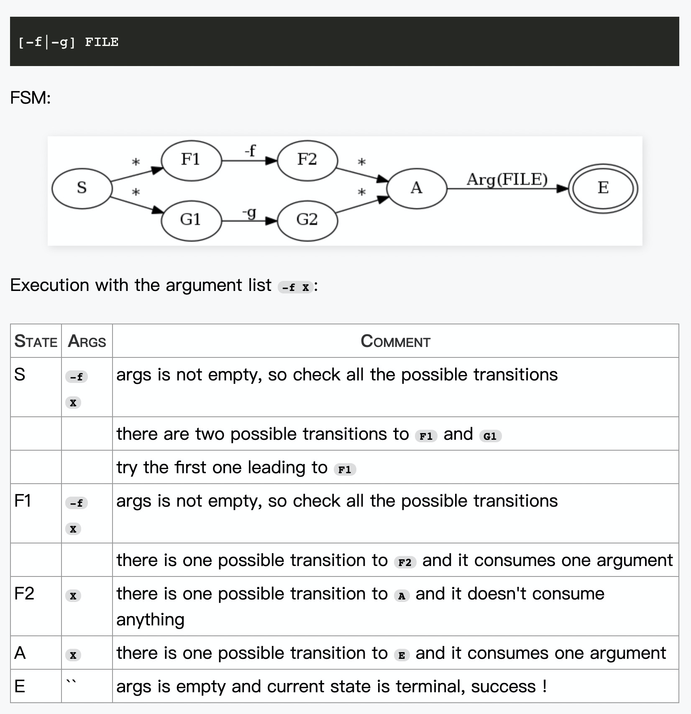

# clipanion-test

[clipanion](https://github.com/arcanis/clipanion) 是一个非常新的模块，写了不到1年，在2020年2月26日只有77个star。

为啥我如何次看好它呢？具体如下。

## 特性

- Clipanion 支持 advanced typing mechanisms
- Clipanion 支持 nested commands (`yarn workspaces list`)
- Clipanion 支持 transparent option proxying without `--` (for example `yarn dlx eslint --fix`)
- Clipanion 支持 all option types you could think of (including negations, batches, ...)
- Clipanion offers a [Yup](https://github.com/jquense/yup) integration for increased validation capabilities
- Clipanion generates an optimized state machine out of your commands
- Clipanion generates good-looking help pages out of the box

Clipanion被用在下一代Yarn里 [Yarn](https://github.com/yarnpkg/berry)，效果非常好.

## Usage

```
$ clipanion greet --help
$ bin greet [-v,--verbose] [--name #0]
$ clipanion greet -v
You're not registered.
$ clipanion greet --name alfred
Hello, alfred!
```

## Code

用的是官方的例子，稍微改了一下。

```ts
#!/usr/bin/env node

import {Cli, Command} from 'clipanion';

class GreetCommand extends Command {
    @Command.Boolean(`-v,--verbose`)
    public verbose: boolean = false;

    @Command.String(`--name`)
    public name?: string;

    @Command.Path(`greet`)
    async execute() {
        if (typeof this.name === `undefined`) {
            this.context.stdout.write(`You're not registered.\n`);
        } else {
            this.context.stdout.write(`Hello, ${this.name}!\n`);
        }
    }
}

const cli = new Cli({
    binaryLabel: `Clipanion Test`,
    binaryName: `clipanion`,
    binaryVersion: `1.0.0`,
});

cli.register(GreetCommand);

cli.runExit(process.argv.slice(2), {
    stdin: process.stdin,
    stdout: process.stdout,
    stderr: process.stderr,
});
```
## clipanion vs commander.js

对比一下经典的[commander.js](https://github.com/tj/commander.js)

```js
const program = require('commander');

program
  .command('rm <dir>')
  .option('-r, --recursive', 'Remove recursively')
  .action(function (dir, cmdObj) {
    console.log('remove ' + dir + (cmdObj.recursive ? ' recursively' : ''))
  })

program.parse(process.argv)
```

很明显，commander是更加js的链式写法，简单，描述性强。

而clipanion是更加ts的面向对象的，GreetCommand 继承自 Command，核心执行方法是execute。一看就是典型的模板模式。

- 基于Class来编写cli
- 基于装饰器，用起来更简单

## 数据结构

在source/core.ts里，有关于代码调试的日志控制，很内敛，和经典的debug很像。

```
export const DEBUG = process.env.DEBUG_CLI === `1`;

export function debug(str: string) {
    if (DEBUG) {
        console.log(str);
    }
}
```

那么，我们就可以再来测试一下。

```
$ DEBUG_CLI=1 clipanion greet --name i5ting
Running a vm on ["greet","--name","i5ting","\u0000"]
  Nodes are:
    0: {"dynamics":[],"shortcuts":[],"statics":{"\u0001":[{"to":4,"reducer":["setCandidateUsage","bin greet [-v,--verbose] [--name #0]"]}]}}
    1: {"dynamics":[],"shortcuts":[],"statics":{}}
    2: {"dynamics":[],"shortcuts":[],"statics":{}}
    3: {"dynamics":[],"shortcuts":[],"statics":{"\u0001":[{"to":4,"reducer":["setCandidateUsage","bin greet [-v,--verbose] [--name #0]"]}]}}
    4: {"dynamics":[[["isOption","--"],{"to":5,"reducer":"inhibateOptions"}],[["isBatchOption",["-v","--verbose","--name"]],{"to":5,"reducer":"pushBatch"}],[["isBoundOption",["-v","--verbose","--name"]],{"to":5,"reducer":"pushBound"}],[["isUnsupportedOption",["-v","--verbose","--name"]],{"to":2,"reducer":["setError","Unsupported option name"]}],[["isInvalidOption"],{"to":2,"reducer":["setError","Invalid option name"]}],[["isOption","-v"],{"to":5,"reducer":"pushTrue"}],[["isOption","--verbose"],{"to":5,"reducer":"pushTrue"}],[["isNegatedOption","--verbose"],{"to":5,"reducer":["pushFalse","--verbose"]}],[["isOption","--name"],{"to":6,"reducer":"pushUndefined"}]],"shortcuts":[],"statics":{"greet":[{"to":7,"reducer":"pushPath"}]}}
    5: {"dynamics":[[["isOption","--"],{"to":5,"reducer":"inhibateOptions"}],[["isBatchOption",["-v","--verbose","--name"]],{"to":5,"reducer":"pushBatch"}],[["isBoundOption",["-v","--verbose","--name"]],{"to":5,"reducer":"pushBound"}],[["isUnsupportedOption",["-v","--verbose","--name"]],{"to":2,"reducer":["setError","Unsupported option name"]}],[["isInvalidOption"],{"to":2,"reducer":["setError","Invalid option name"]}],[["isOption","-v"],{"to":5,"reducer":"pushTrue"}],[["isOption","--verbose"],{"to":5,"reducer":"pushTrue"}],[["isNegatedOption","--verbose"],{"to":5,"reducer":["pushFalse","--verbose"]}],[["isOption","--name"],{"to":6,"reducer":"pushUndefined"}]],"shortcuts":[],"statics":{"greet":[{"to":7,"reducer":"pushPath"}]}}
    6: {"dynamics":[["isNotOptionLike",{"to":5,"reducer":"setStringValue"}]],"shortcuts":[],"statics":{}}
    7: {"dynamics":[["isHelp",{"to":8,"reducer":["useHelp",0]}],[["isOption","--"],{"to":7,"reducer":"inhibateOptions"}],[["isBatchOption",["-v","--verbose","--name"]],{"to":7,"reducer":"pushBatch"}],[["isBoundOption",["-v","--verbose","--name"]],{"to":7,"reducer":"pushBound"}],[["isUnsupportedOption",["-v","--verbose","--name"]],{"to":2,"reducer":["setError","Unsupported option name"]}],[["isInvalidOption"],{"to":2,"reducer":["setError","Invalid option name"]}],[["isOption","-v"],{"to":7,"reducer":"pushTrue"}],[["isOption","--verbose"],{"to":7,"reducer":"pushTrue"}],[["isNegatedOption","--verbose"],{"to":7,"reducer":["pushFalse","--verbose"]}],[["isOption","--name"],{"to":9,"reducer":"pushUndefined"}],["isNotOptionLike",{"to":2,"reducer":["setError","Extraneous positional argument"]}]],"shortcuts":[],"statics":{"\u0000":[{"to":1,"reducer":["setSelectedIndex",0]}]}}
    8: {"dynamics":[],"shortcuts":[],"statics":{"\u0000":[{"to":1,"reducer":["setSelectedIndex",-1]}]}}
    9: {"dynamics":[["isNotOptionLike",{"to":7,"reducer":"setStringValue"}]],"shortcuts":[],"statics":{}}
  Processing "\u0001"
    Current node is 0
      Static transition to 4 found
  Processing "greet"
    Current node is 4
      Static transition to 7 found
  Processing "--name"
    Current node is 7
      No static transition found
      Dynamic transition to 9 found (via isOption,--name)
  Processing "i5ting"
    Current node is 9
      No static transition found
      Dynamic transition to 7 found (via isNotOptionLike)
  Processing "\u0000"
    Current node is 7
      Static transition to 1 found
  Results:
    - 1 -> {"candidateUsage":"bin greet [-v,--verbose] [--name #0]","errorMessage":null,"ignoreOptions":false,"options":[{"name":"--name","value":"i5ting"}],"path":["greet"],"positionals":[],"selectedIndex":0}
Hello, i5ting!
```

要点

- cli解析成["greet","--name","i5ting","\u0000"]
- Nodes是状态节点
- Processing是处理步骤
- Results是最终结果

继续看source/core.ts源码，会发现这是一个fsm状态机。参考https://jawher.me/2015/01/18/parsing-command-line-arguments-finite-state-machine-backtracking/这篇文章。



将选项、参数、起止状态都做了抽象。结合源码

```ts
export type RunState = {
    candidateUsage: string | null;
    errorMessage: string | null;
    ignoreOptions: boolean;
    options: {name: string, value: any}[];
    path: string[];
    positionals: {value: string, extra: boolean}[];
    selectedIndex: number | null;
};
```

集合dynamics和statics是对状态的加工处理，然后reducer处理。就可以理解上图的原理了。

另外，可以考虑使用pegjs来实现fsm，可以越玩越高级的。

## 结论

ts已经是当下政治正确了，所以这种写法，会是主流写法。从这2种写法，大大的拓展了我们的想象力。

- 对习惯OO的程序员更加友好，比如java、ruby这些程序员
- 对前端要求更高，面向过程到面向对象的思维转化

npm上120万+模块，绝大部分都是js写法的，未来需要ts化的模块也是非常多的。我看到的更多的是机会，会让很多人有更多自我实现，甚至是成名机会。